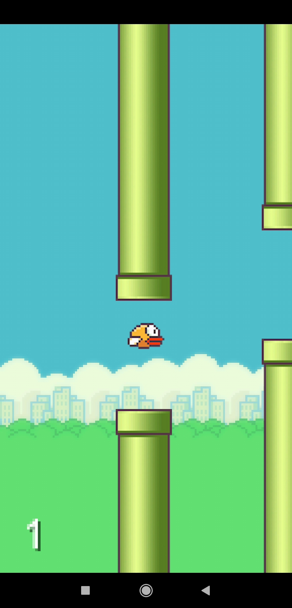
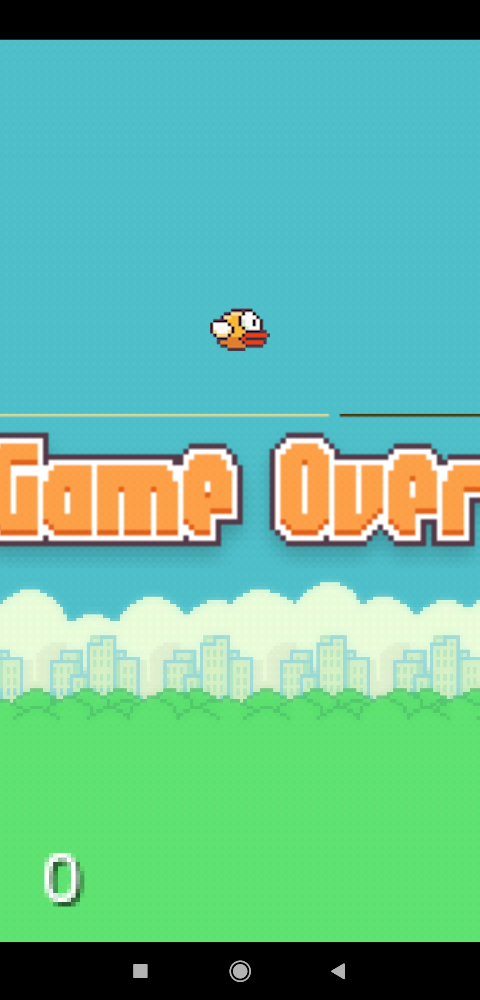

# FlappyBird
Download the app from https://drive.google.com/file/d/1f8S-h18bJszx7-HySlZXBjygf-0rZr7e/view?usp=sharing
## About
This project is an android application which is a clone of the famous Flappy bird game application. 
The application is developed using Libgdx library and is compatible with almost all old and every latest version of the android. 
You need to tap on the screen to start the game. 
Your aim is to keep the bird in air and go through the pipes to increase your score. 
The bird will jump each time you tap on the screen. 
If the bird touches any pipe or fall down, you will lose. 
Once the game is over, you need to click on the screen to start again.

## Libraries this app use
- LibGdx - https://libgdx.badlogicgames.com/
## Screenshots

